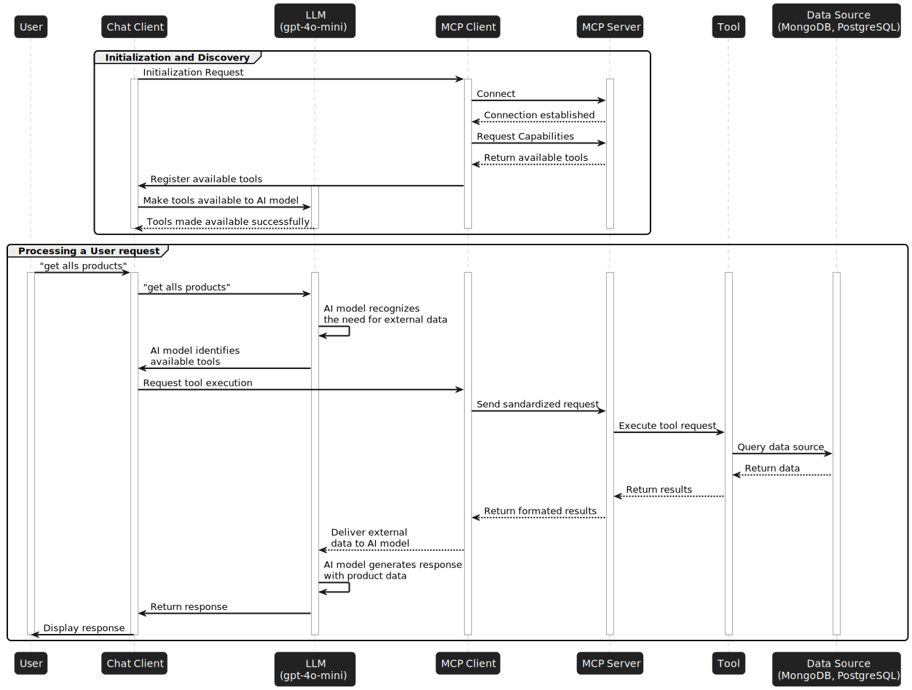

# Spring AI MCP Examples
This project demonstrates how to build and integrate a **Model-Controller-Prompt (MCP)** architecture using **Spring Boot** and **Spring AI**. It includes both an **MCP Client** and an **MCP Server**, showcasing how AI models can dynamically interact with external tools and data sources (**MongoDB**, **PostgreSQL**) to fulfill user requests in real time.
* **Full blog:** https://blog.nashtechglobal.com/building-an-mcp-server-and-client-using-java-spring-boot-ai/

## Features
* **Data Source Integration**: Connects to a local MongoDB, PostgreSQL to perform various operations.
* **Callable Tools with ```@Tool``` Annotation**:
Tool methods are declared using the ```@Tool``` annotation, making them discoverable and callable by the AI model at runtime.

* **Tool Registration with** ```ToolCallbackProvider```: Used to expose and register tools dynamically during initialization, enabling seamless integration with Spring AI.


## How It Works 
The MCP workflow in these examples follows these steps:



### Initial Setup and Discovery

1. **Connection Initialization**
* When the host application starts, its Chat Client sends an initialization request to the MCP Client.
* The MCP Client establishes a connection to the configured MCP Server.

2. **Capability Discovery**
* The MCP Client asks the MCP Server: “What capabilities (tools) do you offer?”
* The MCP Server responds with metadata describing all available tools, such as names, parameters, and descriptions.

4. **Registration**
* The MCP Client forwards this tool list to the Chat Client.
* The Chat Client registers these tools with the AI model (LLM) so it knows what tools are available at runtime.
* The AI model confirms: “These tools are now available for me to use.”

### Processing a User Request
Let’s say a user asks: _"Get all products"_

1. **Need Recognition**
* The Chat Client receives the user’s message and forwards it to the AI model.
* The AI model analyzes the prompt and determines it requires external data (e.g., a product list from a database).

2. **Tool Selection**
* The AI model selects a registered tool that can handle the request, e.g., getProductsTool.

3. **Tool Invocation**
* The Chat Client requests the MCP Client to execute the selected tool.
* The MCP Client sends a standardized request to the MCP Server.
* The MCP Server executes the corresponding tool logic.

4. **Data Retrieval**
* The tool queries the necessary data source (e.g., MongoDB or PostgreSQL).
* The database responds with the requested product data.
* The tool sends the data back up to the MCP Server, which relays it to the MCP Client.

5. **Response Generation**
* The MCP Client returns the external data to the AI model.
* The AI model generates a final natural language response that incorporates the data.

6. **Result Delivery**
* The Chat Client sends the completed response back to the user interface.
* The user sees the answer: e.g., “Here are 10 products currently available.”


## Running the Examples

### Prerequisites

* Java 21
* SpringBoot 3.5.3
* Spring AI 1.0.0
* MongoDB
* Postgresql
* Docker
* OpenAI API key

### Step 1: Run Docker Compose to set up MongoDB and PostgreSQL with init data

```sh
docker compose up -d
```
### Step 2: Update application.yaml with OpenAI API Key:
* [**Open API Key**](https://github.com/duongminhhieu/springboot-ai-mcp-example/blob/master/mcp-client/src/main/resources/application.yml#L9)
* Get OpenAI API key [here] (https://platform.openai.com/api-keys)

### Step 3: Run MCP Server
```bash
cd mcp-server
./mvnw spring-boot:run
```
### Step 4: Run MCP Client
```bash
cd mcp-client
./mvnw spring-boot:run
```
### Step 5: Test in Postman 

* Test with **PostgreSQL**
```curl
curl --location 'localhost:8081/chat/ask' \
--header 'Content-Type: text/plain' \
--data 'Requirement: [Postgres] In the table orders, retrieve all orders that have status COMPLETED

Rules:
1. Respond strictly in JSON format, conforming to RFC 8259.
2. The JSON structure must align with the java.util.HashMap format.
3. Do not include explanations, comments, or any labels like ```json```.'
```

* Test with **MongoDB**
```curl
curl --location 'localhost:8081/chat/ask' \
--header 'Content-Type: text/plain' \
--data 'Requirement: Retrieve all documents from the product-service collection, products table, where the price > 100

Rules:
1. Respond strictly in JSON format, conforming to RFC 8259.
2. The JSON structure must align with the java.util.HashMap format.
3. Do not include explanations, comments, or any labels like ```json```.'
```
| PostgreSQL | MongoDB |
|--------------|--------------|
|  |  |


## References
* https://docs.spring.io/spring-ai/reference/api/mcp/mcp-overview.html
* Supported by ChatGPT

